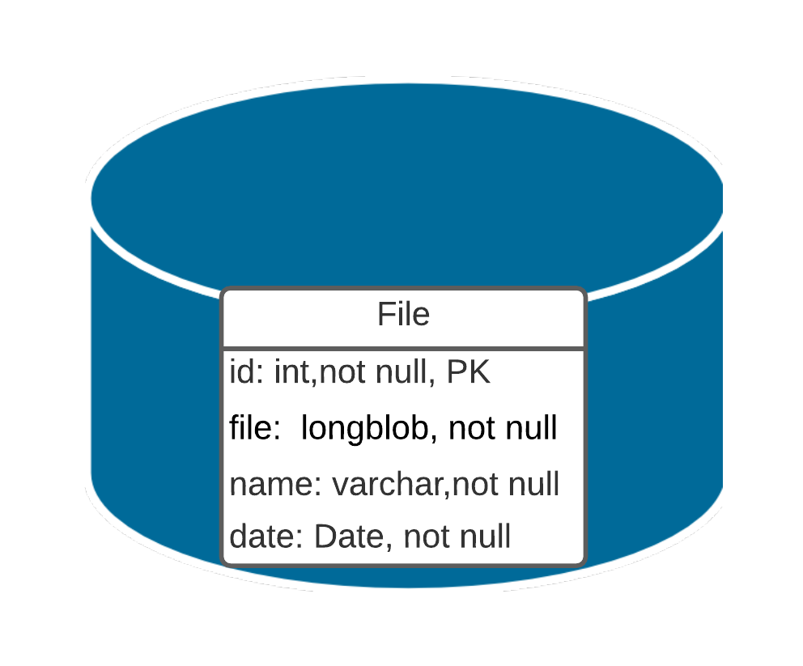

# Levantamento de requisitos

---

## Requisitos do usuário

O sistema deve possibilitar ao usuário:

- Buscar arquivos por nome
- Buscar arquivos por cpf
- Inserir,remover,atualizar e abrir arquivos

O sistema deve conter:

- Banco de dados
- Mecanismos de busca
- listagem de arquivos
  
## Artefatos

Diagrama de caso de uso:

Diagrama de classe:

Diagrama entidade relacionamento:

